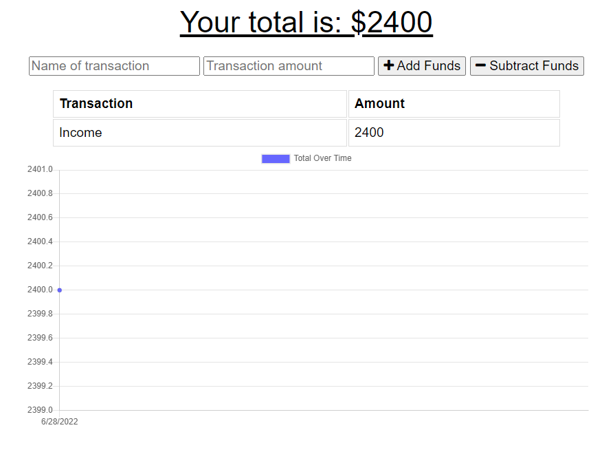

# BudgetTrackerPWA

## Description

 
A progressive web application designed for offline functionality to track your income and expenses.  

**Languages and Technologies Used:** 
- JavaScript ES6
- Node.js
- Express.js
- MongoDB
- IndexedDB/Service Workers/Manifest

## Table of Contents

1. [ Usage ](#usage)
2. [ License ](#license)
3. [ Contributing ](#contributing)
4. [ Questions ](#questions)

## Usage
To use this application, please visit the deployed application on [Heroku](https://budgettrackerbytaimur.herokuapp.com/).  

## License
This project is licensed under the MIT License - see the [license info](https://opensource.org/licenses/MIT) for details.

## Contributing

This project can be contributed to by forking the application. For any contributions, please submit a Pull Request, which will be reviewed upon submission before acceptance.

## Questions

[GitHub](https://github.com/TaimurHasan)  
For any questions, please send an Email to [taimurhasan11@gmail.com](mailto:taimurhasan11@gmail.com)